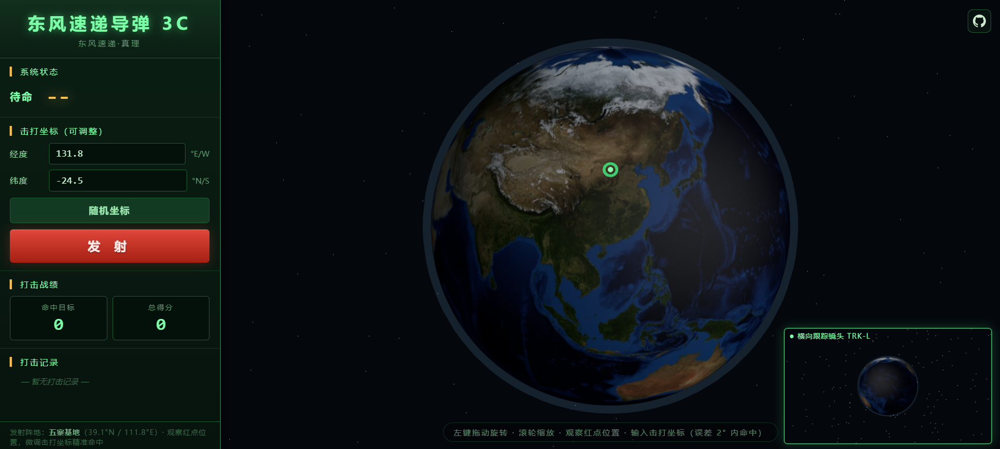
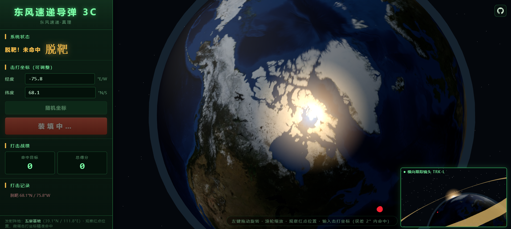

# 东风速递导弹 3C

**东风速递 · 真理** —— 基于 three.js 的全球打击坐标寻靶游戏（3D 网页游戏）。

> "东风快递，使命必达" —— 随机目标坐标对玩家隐藏，你需要通过观察地球上的红点位置，
> 手动调整击打坐标，精准命中红点目标。误差 2° 内即为命中。

🎮 **在线试玩**：https://dongfeng-express.pages.dev/

## 游戏截图





## 玩法规则

1. 游戏开始时，地球上随机生成一个**待打击目标（红点）**，但其经纬度坐标对玩家**未知**；
2. 左侧面板输入**击打坐标**（经度/纬度），即导弹要飞向的位置——初始为随机盲猜值；
3. 点击 **发射** → 3 秒倒计时（可再次点击取消）→ 导弹沿真实弹道飞向击打坐标；
4. **命中判定**：导弹落点与红点角距 < 2° 判定命中：
   - **命中** → +100 分，红点销毁并生成新红点（坐标再次未知）；
   - **脱靶** → 不积分，红点**一直保留**在原位置，直到被精准击中；
5. 可通过 **随机坐标** 按钮生成新的盲猜坐标（与红点大概率不一致，不会命中）；
6. 打击记录区显示每次命中的坐标与得分（命中黄色 / 脱靶灰色）。

## 核心特性

| 特性 | 说明 |
|---|---|
| 3D 地球 | 真实卫星贴图（http(s) 下加载）+ 星空背景 + 大气光晕 |
| 真实弹道模拟 | 快速上升 → 高空平流层巡航平台 → 再入俯冲三段剖面；飞行时间随射程变化（近程约 3.3s，远程约 9.5s） |
| 阶段状态栏 | 飞行中实时显示：上升阶段 / 平流层巡航 / 再入下降 |
| 电影级镜头调度 | 起飞正面 → 空中跟随（球面插值不穿模）→ 目标上空俯冲 → **上空俯视爆炸 3 秒** |
| 画中画 | 右下角常驻**横向跟踪镜头**（TRK-L），飞行侧拍、爆炸横拍、常态固定机位 |
| 爆炸特效 | 火球扩散 / 冲击波 / 碎片粒子 / 爆闪灯光 / 屏幕红光 / 震屏 |
| 音效 | 纯 WebAudio 合成（倒计时滴答、点火、爆炸轰鸣），无外部音频资源 |
| 零依赖 | three.js r159 UMD 已本地化，无 CDN、无构建步骤，双击即可运行 |

## 技术栈

- [three.js](https://threejs.org/) r159（UMD 本地版，`js/three.min.js`）
- 原生 HTML / CSS / JavaScript（无框架、无构建工具）
- 导弹模型为程序化建模（两级弹体 + 鼻锥 + 红色涂装 + 梯形尾翼 + 喷口）

## 目录结构

```
├── index.html          # 页面入口（左侧控制面板 + 右侧 3D 场景 + 画中画）
├── js/
│   ├── three.min.js    # three.js r159 本地库
│   └── main.js         # 全部游戏逻辑（场景/弹道/镜头/特效/玩法）
├── assets/
│   └── earth.jpg       # 地球贴图（http(s) 下自动加载；file:// 下使用程序化贴图兜底）
├── .gitignore
└── package.json        # 仅用于下载依赖的临时产物，运行不需要
```

## 运行方式

**方式零：在线试玩**（已部署 Cloudflare Pages）
直接访问 <https://dongfeng-express.pages.dev/>（https 下自动加载真实卫星贴图）。

**方式一：直接打开**（最简单）
双击 `index.html` 即可游玩（file:// 下地球使用程序化大陆纹理兜底，全功能可用）。

**方式二：本地服务器**（加载真实卫星贴图）
```bash
# Python
python -m http.server 8000
# 或 Node
npx serve
```
然后浏览器访问 `http://localhost:8000`。

## 操作说明

- **左键拖动**：旋转视角
- **滚轮**：缩放
- **输入框**：设置击打坐标（经度 -180~180，纬度 -90~90）
- **发射**：3 秒倒计时后发射（倒计时中再点可取消）
- **随机坐标**：生成随机盲猜坐标

## 提示与技巧

- 观察红点在地球上的位置（哪个大洲/海域），结合经纬网大致估算坐标；
- 先用"随机坐标"或发射一次观察落点偏差，再逐步微调收敛到红点；
- 红点命中前会一直存在，可以反复试射（脱靶不扣分，只考验你的定位能力）。

## 已知说明

- `node_modules/` 与 `package.json` 是为下载 three.js 与贴图产生的临时产物，游戏运行**不依赖**它们，可安全删除；
- 爆炸后导弹**不残留轨迹线**，保持地图干净；
- 画中画为独立渲染器，与主视角共享场景，性能开销极小。
